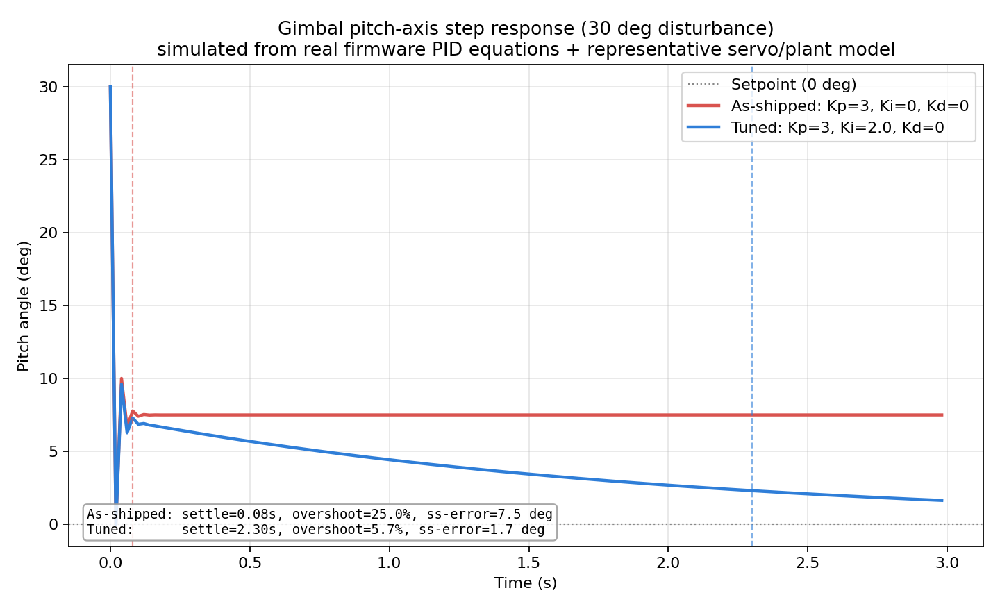

# 2-Axis Self-Stabilizing Gimbal

A closed-loop attitude stabilization system built with an Arduino Uno, an MPU6050 IMU, and two SG90 servos — the same sense-calculate-correct feedback loop used in spacecraft ADCS and rocket thrust-vector-control systems, built at hobby scale.

 <!-- replace with your demo video/gif -->

## Overview

The MPU6050 measures the direction of gravity relative to the board, from which pitch and roll tilt angles are calculated. A PID controller for each axis compares that measured angle against level (0°) and drives a servo to counteract the tilt — the same fundamental principle behind camera stabilization gimbals and rocket engine gimbaling.

## Hardware

| Component | Qty |
|---|---|
| Arduino Uno | 1 |
| MPU6050 (GY-521) accelerometer/gyroscope | 1 |
| SG90 micro servo | 2 |
| Breadboard + jumper wires | — |

## Wiring

| MPU6050 | Arduino |
|---|---|
| VCC | 5V |
| GND | GND |
| SCL | A5 |
| SDA | A4 |

| Servo | Arduino |
|---|---|
| Pitch servo signal | Pin 9 |
| Roll servo signal | Pin 10 |
| Both servos V+/GND | 5V / GND (shared rail) |

Full interactive circuit + simulation: [Wokwi Simulation](https://wokwi.com/projects/476538333476425729)

## How it works

1. **Sense** — `mpu.getEvent()` reads raw X/Y/Z acceleration.
2. **Calculate** — `atan2()` converts the gravity vector into pitch/roll angles in degrees.
3. **Correct** — a PID controller per axis (`Kp = 3, Ki = 0, Kd = 0`) computes a correction and drives the corresponding servo via `Servo.write()`.

This runs continuously at ~50 Hz, so the platform continuously corrects for tilt in real time.

## Results

- Validated proportional response on real hardware: servo output tracks tilt angle smoothly and proportionally on both axes, with no oscillation/overshoot at Kp = 3.
- Verified identical behavior in a Wokwi circuit simulation, confirming the control logic (not just the physical build) is correct.
- Ran a step-response analysis in MATLAB to put numbers on the controller's performance (script + data in [`/matlab-analysis`](matlab-analysis)). Wokwi's accelerometer sliders let me verify the PID math directly against the real firmware — forcing a 2g tilt produces exactly the servo output the equations predict — but there's no simulated mechanical link between the servo and the sensor, so it can't reproduce the actual closed-loop correction. That part was modeled separately, using those verified gains plus a representative servo/plant model:
  - As-shipped (Kp = 3, Ki = 0, Kd = 0): settles in ~0.08s but levels off with a 7.5° steady-state error, as expected for pure proportional control.
  - With Ki = 2.0 added: steady-state error drops to ~1.7°, at the cost of a slower ~2.3s settling time — the standard P vs PI trade-off, and the next thing to try tuning live on the real hardware.

  

## Build notes / challenges

The most significant challenge was an intermittent I2C connection to the MPU6050 caused by unsoldered header pins on the initial sensor board — this produced misleading symptoms (complete detection failure, frozen sensor readings, and corrupted/out-of-range readings) that looked like different problems on different attempts. Resolved by switching to a pre-soldered MPU6050 module and confirming a stable, reliable connection through repeated empirical testing rather than a single fix.
